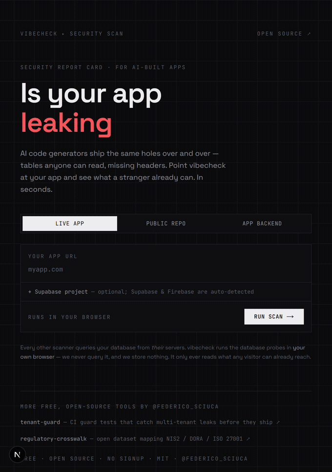
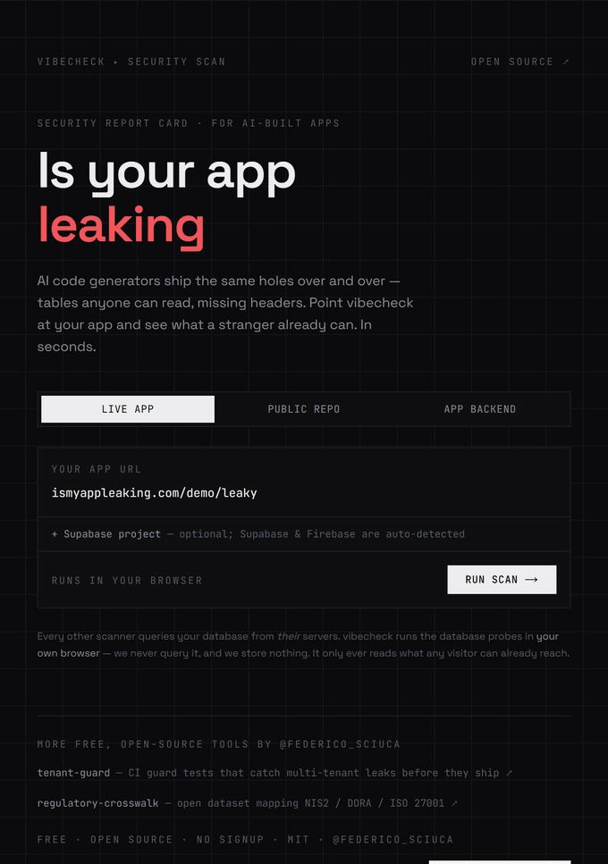

<div align="center">

# vibecheck

**Is your AI-built app leaking? Paste a URL — get a security report card in seconds.**

Free · open source · no signup · the database check runs in _your_ browser



**[Try it →](https://ismyappleaking.com)**  ·  [See what a failing report looks like](https://ismyappleaking.com/demo/leaky)

</div>

---

## Why

AI code generators — Lovable, Bolt, v0, Cursor, Claude Code — ship the same handful of holes over and over. The clearest example is [CVE-2025-48757](https://nvd.nist.gov/vuln/detail/CVE-2025-48757): 170+ Lovable projects were found with Row Level Security off, so anyone holding the public `anon` key (it's in the frontend) could read their database tables. That class of bug is invisible from the outside — unless you actually probe for it.

## What makes it different

**The database check runs in _your_ browser, not on a server.** Every other scanner queries your database from _their_ backend. vibecheck uses the anon/public key your app already ships to mirror exactly what any visitor can read — client-side — so it never sees your data or your key. A mirror, not an exploit. Self-scan only.

## What it checks

Three ways in:

**🌐 Live app** — paste a URL:

- **Database exposure** — Supabase (RLS/public-read) **and** Firebase (Firestore + Realtime DB), probed from your browser
- **Secrets in the client bundle** — Stripe/AWS/DB URLs, `service_role` / `sb_secret_` keys
- **Security headers**, exposed `.env` / `.git` / source maps, admin & debug routes
- **AI & MCP endpoints** — unauthenticated LLM proxies (credit-drain) and anonymous MCP tool lists
- **Email spoofing** (SPF/DMARC), **TLS** + subdomain takeover, HTTPS enforcement
- **EU privacy** — GDPR signals + AI Act Article 50 chatbot disclosure
- **SEO / LLM visibility** — is your content even readable by a crawler or an assistant?

**📦 Public repo** — cross-tenant IDOR patterns, committed secrets, an [OSV.dev](https://osv.dev) supply-chain check, a Dockerfile lint, and a downloadable CycloneDX **SBOM**.

**📱 Mobile app** — drop in an `.apk` / `.ipa`; it unzips and scans the JS bundle for the same leaks, entirely in your browser — the file never leaves your device.

Every failing check comes with a **fix you can paste straight into Lovable, Cursor, v0 or Claude**.

## See it work

<table>
<tr>
<td width="50%" valign="top">

**Find → fix, in one paste**



</td>
<td width="50%" valign="top">

**Three form factors**


</td>
</tr>
</table>

## Honest limits

It's an outside-in scanner, not a pentest. No active injection testing (it won't point that at other people's apps), no native-binary decompilation, and for a _private_ repo the source-level checks live in a separate CLI. Everything is an observation, never a legal conclusion.

## Catch it in CI

Found a leak? For your real (private) repo, run the same checks — plus a live Postgres proof that one tenant cannot read another — as CI tests that fail the build:

```bash
npx tenant-guard init
```

[**tenant-guard**](https://github.com/FedericoTs/tenant-guard) — free & open source.

## Develop

```bash
npm install
npm run dev      # http://localhost:3000
npm test         # scan-engine unit tests (vitest)
npm run build
```

The scan engine lives in [`lib/scan/`](lib/scan/) as pure, dependency-injected functions — the network `fetch` is injected — so every rule is unit-tested without a live target.

## Licence

MIT · by [Federico Sciuca](https://x.com/federico_sciuca) · free, open source, no signup, no cookies.
